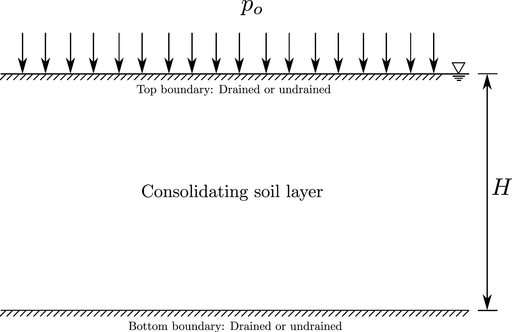

#### Author: [Yared W. Bekele](https://yaredwb.com/)

### Abstract

Neural networks with physical governing equations as constraints have recently created a new trend in machine learning research. In line with such efforts, a deep learning model for one-dimensional consolidation where the governing equation is applied as a constraint in the neural network is presented here. A review of related research is first presented and discussed. The deep learning model relies on automatic differentiation for applying the governing equation as a constraint. The total loss is measured as a combination of the training loss (based on analytical and model predicted solutions) and the constraint loss (a requirement to satisfy the governing equation). Two classes of problems are considered: forward and inverse problems. The forward problems demonstrate the performance of a physically constrained neural network model in predicting solutions for one-dimensional consolidation problems. Inverse problems show prediction of the coefficient of consolidation. Terzaghi's problem with varying boundary conditions is used as an example and the deep learning model shows a remarkable performance in both the forward and inverse problems. While the application demonstrated here is a simple one-dimensional consolidation problem, such a deep learning model integrated with a physical law has huge implications for use in, such as, faster real-time numerical prediction for digital twins, numerical model reproducibility and constitutive model parameter optimization.

# Introduction

Machine learning has been (and still is) a fast growing field of research over the last years with ever growing areas of application outside pure computer science. Deep learning, a particular subset of machine learning which uses artificial neural networks, is being applied in various disciplines of science and engineering with usually surprising levels of success. Recently, the application of deep learning related to partial differential equations (PDEs) has been picking up pace. Several researchers are contributing to this effort where different names are given to the use of deep learning associated with physical systems governed by PDEs. Some of the commonly encountered labels include *physics-informed neural networks*, *physics-based deep learning*, *theory-guided data science* and *deep hidden physics models*, to name a few. In general, the aims of these applications include improving the efficiency, accuracy and generalization capability of numerical methods for the solution of PDEs.

Application of deep learning to one-dimensional consolidation problems is presented here. The problem describes fluid flow and excess pore water pressure dissipation in porous media. The governing equation for the problem is first discussed briefly. The deep learning model for the governing partial differential equation is then described. The problem is studied both for forward and inverse problems and the results from these are presented subsequently.

# Governing Equation

The theory of consolidation describes the dissipation of fluid from a porous medium under compressive loading, thereby causing delay of the eventual deformation of the porous medium. The governing equation for one-dimensional consolidation is given by

$$
\begin{equation}
\frac{\partial p}{\partial t} - \frac{\alpha m_v}{S + \alpha^2 m_v} \frac{\partial \sigma_{zz}}{\partial t} - c_v \frac{\partial^2 p}{\partial z^2} = 0
\label{eq:cons1D}
\end{equation}
$$

where $p$ is the pore fluid pressure, $\alpha$ is Biot's coefficient, $S$ is the storativity of the pore space, $m_v$ is the confined compressibility of the porous medium, $ \sigma_{zz} $ is the the vertical effective stress and $c_v$ is the coefficient of consolidation. The classical one-dimensional consolidation problem is that at time $ t=0 $ a compressive load in the direction of fluid flow is applied and the load is maintained for $ t > 0 $. This implies that, for $ t > 0 $, the stress $ \sigma_{zz} $ is constant, say with a magnitude $q$. Thus, we can reduce the general equation in \eqref{eq:cons1D} as

$$
\begin{equation}
\begin{aligned}
\text{For} \; t = 0: \quad & p = p_o = \dfrac{\alpha m_v}{S + \alpha^2 m_v} q \\
\text{For} \; t > 0: \quad & \dfrac{\partial p}{\partial t} - c_v \dfrac{\partial^2 p}{\partial z^2} = 0
\end{aligned}
\label{eq:cons1Dt0andt}
\end{equation}
$$

{: .center-image width="600px"}

The first equation in \eqref{eq:cons1Dt0andt} establishes the initial condition for the 1D consolidation problem where we note that at $ t = 0 $ the total vertical load is carried by the pore fluid and we don't yet have any fluid dissipation from the porous medium. Whereas, the second equation governs the dissipation rate of the pore fluid as a function of both time and spatial dimension. This equation may be solved for various drainage boundary conditions at the top and bottom of the porous medium through either analytical or numerical methods. We consider an analytical solution here for two different drainage boundary conditions, which are described in a later section.

# Deep Learning Model

In this section, the neural network architecture and the approach for a applying a physical constraint based on the governing one-dimensional consolidation equation are discussed. The model training procedure and the hyper-parameters that are controlled during training are also presented.

## Neural Network Architecture

A fully-connected deep neural network with the desired number of layers and hidden units is used as a model to be trained with the one-dimensional consolidation problem. An illustration of the neural network architecture is shown in the figure below. For the one-dimensional consolidation problem here, the input layer provides inputs of $(z,t)$ values from the training data, which usually includes initial and boundary condition data; the details are discussed in forward and inverse numerical example sections later.    

{: .center-image }

The neural network with the desired number of hidden layers and hidden units performs predictions of the excess pore pressure, which is then used to compute the loss based on the excess pore pressure training data. The neural network also includes a physical constraint based on the governing one-dimensional consolidation equation, where the constraint is evaluated using automatic differentiation, briefly discussed in a sub-section below. The neural network is designed to optimize both the *training loss* and the physical constraint.

## Automatic Differentiation

A key part of the deep learning model for the problem here is automatic differentiation. It is important to not confuse automatic differentiation with other methods of computing derivatives in computer programs. There are four ways of computing derivatives using computers: a) manually obtaining the derivatives and coding them; b) numerical differentiation using finite difference approximations; c) computer-based symbolic differentiation and subsequent evaluation based on the algebraic expressions; and d) automatic differentiation, which is what is used here. Like the other methods, automatic differentiation provides numerical values of derivatives where these are obtained by using the rules of symbolic differentiation but by keeping track of derivative values instead of obtaining the final expressions. This approach of tracking derivative values makes automatic differentiation superior to the two most commonly used methods of computing derivatives, namely numerical differentiation and symbolic differentiation. Automatic differentiation exploits the fact that any derivative computation, no matter how complex, is composed of a sequence of elementary arithmetic operations and elementary function evaluations. It applies the chain rule repeatedly to these operations until the desired derivative is computed. Such an approach for computation makes automatic differentiation to be accurate at machine precision and computationally less demanding than other methods. For evaluating the derivatives in the governing one-dimensional equation here, the automatic differentiation capability in `TensorFlow` is utilized. `TensorFlow` provides an API for automatic differentiation by recording all operations and computing the gradients of the recorded computations using reverse mode differentiation.

## Model Training and Hyper-parameters

The deep learning model training is performed in slightly different ways for forward and inverse problems. However, the model hyper-parameters in both cases are adjusted in a similar way. For *forward problems*, the training data involves initial and boundary condition data i.e. a pair of initial and boundary $(z,t)$ values and the corresponding excess pore pressure values $p(z,t)$. The model predicts the excess pore pressure value $\hat{p}$ for a given data point. The *training loss* is calculated as a mean squared error from

$$
\begin{equation}
MSE_p = \frac{1}{N} \sum_{k=1}^{N} \left| p(z_k,t_k) - \hat{p}(z_k,t_k) \right|^2,
\end{equation}   
$$

where $N$ is the number of training data and $(z_k,t_k)$ represents the training data point. The physical constraint based on the governing partial differential equation is applied at randomly generated collocation points $(z_c,t_c)$. The collocation points are generated by using a latin hypercube sampling strategy where the bounds of the original training data are taken into consideration. The physical constraint is evaluated at the collocation points based on the predicted excess pore pressure using automatic differentiation i.e.

$$
\begin{equation}
f_c = \frac{\partial \hat{p}}{\partial t_c} - c_v \frac{\partial^2 \hat{p}}{\partial z_c^2}.
\end{equation}
$$

The *constraint loss* is calculated as a mean squared error from

$$
\begin{equation}
MSE_c = \frac{1}{N_c} \sum_{k=1}^{N_c} \left| f_c(z_{c,k},t_{c,k}) \right|^2,
\end{equation}
$$

where $N_c$ is the number of collocation points and $(z_{c,k},t_{c,k})$ represents a data point from the collocation points. The total loss from training and the physical constraint is defined as

$$
\begin{equation}
MSE = MSE_p + MSE_c,
\label{eq:total_loss}
\end{equation}
$$

which is minimized by the model optimizer. For *inverse problems*, the training procedure and loss evaluation is mostly similar with some differences. A larger size $(z,t)$ training data is used and collocation points are not generated in this case. This implies that automatic differentiation for the physical constraint is evaluated at the original training data points and the coefficient of consolidation is defined as a trainable parameter i.e.

$$
\begin{equation}
f_c = \frac{\partial \hat{p}}{\partial t} - c_{vt} \frac{\partial^2 \hat{p}}{\partial z^2},
\end{equation}
$$

where $c_{vt}$ is the trained value of the coefficient of consolidation updated during each step. An additional trainable model variable or weight $w_{cv}$, associated with the coefficient of consolidation, is introduced in the neural network and this is used to evaluate $c_{vt}$ based on an exponential function to always guarantee positive values during training i.e.

$$
\begin{equation}
c_{vt} = \exp(w_{cv}).
\end{equation} 
$$

The hyper-parameters tuned during training, both for forward and inverse problems include the *number of layers*, *number of hidden units*, *batch size* and *learning rate*. The batch size is adjusted to control the number of samples from the training data that are passed into the model before updating the trainable model parameters. The total loss here is minimized using the *Adam optimizer} where its associated learning rate is tuned during the training process.

# Forward Problems

